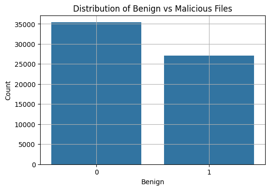
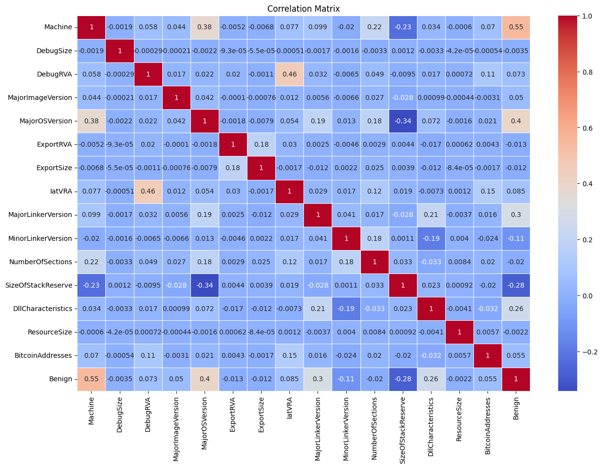
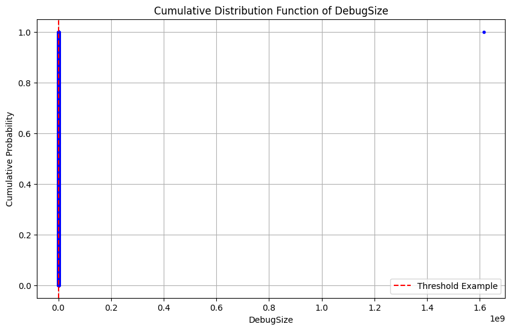
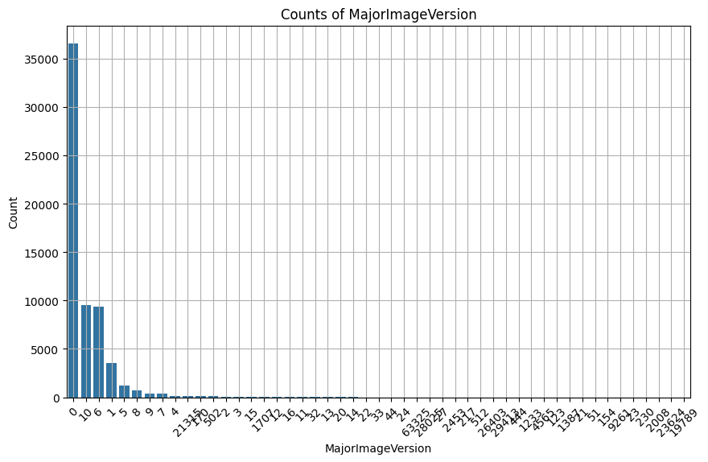
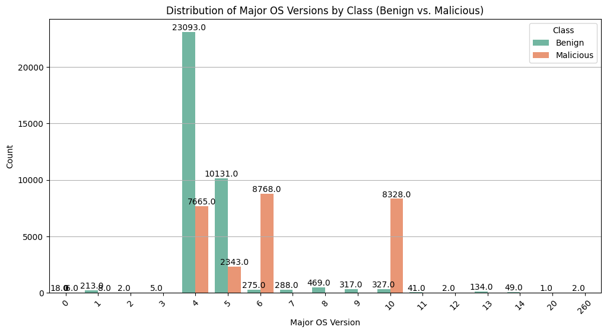
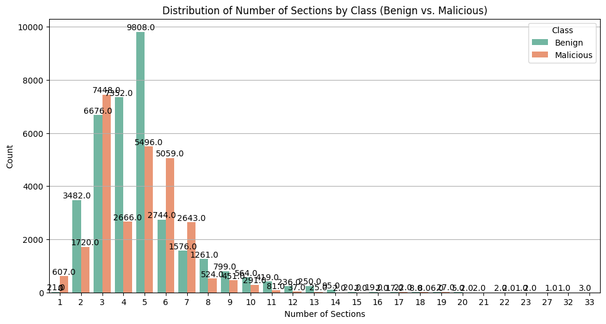
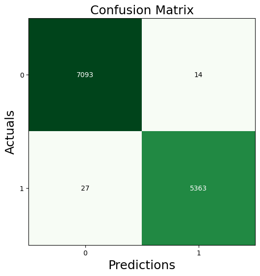
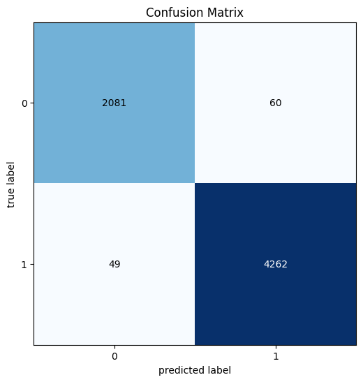

# Ransomware Detection Using AI

## Introduction

In today's digital world, cyber threats are becoming increasingly sophisticated, with one of the most dangerous types being ransomware. Ransomware is malicious software that locks users out of their systems or encrypts their files, demanding a ransom to restore access. We have seen ransomware attacks target large organizations in sectors like healthcare, finance, and critical infrastructure, causing significant financial losses, operational disruptions, and compromising sensitive data.

Traditional security measures such as antivirus programs and firewalls are often insufficient to detect and block ransomware attacks, as cybercriminals continuously evolve their tactics. To combat this growing threat, we propose the use of **Artificial Intelligence (AI)** to detect and mitigate ransomware attacks in real time.

Our project leverages machine learning (ML) algorithms, specifically **Random Forest**, **Long Short-Term Memory (LSTM)** networks, and **Gated Recurrent Units (GRU)**, to build a robust ransomware detection system capable of recognizing suspicious behavior and preventing damage before it occurs.

## Dataset
[Dataset Link](https://github.com/securycore/MLRD-Machine-Learning-Ransomware-Detection)  
The dataset used for this project is based on features extracted from **Portable Executable (PE) files**. It includes both benign and malicious files (ransomware samples) to train and evaluate our models. Below are the key features:

### Features Extracted from PE Files:
- **Debug Info**: Size and Relative Virtual Address (RVA)
- **Version Details**: Major Image Version, Major OS Version, Major/Minor Linker Versions
- **PE Sections**: Number of Sections, Export Size
- **Memory & Addressing**: Import Address Table (IAT) RVA, Size of Stack Reserve
- **File Characteristics**: DLL characteristics
- **Bitcoin Address Detection**: YARA rules identify embedded Bitcoin addresses
- **Correlations**: Cross-referenced results from VirusTotal, ThreatCrowd, and Hybrid Analysis

### Key Features for Analysis:
- **FileName**: Name/identifier of the file (e.g., `file.dll`)
- **md5Hash**: MD5 hash providing a unique identifier for file content
- **Machine**: Platform architecture (e.g., x86 or x64)
- **DebugSize**: Size of the debug information
- **DebugRVA**: Relative Virtual Address of debug information
- **MajorImageVersion**: Major version of the image for the operating system
- **MajorOSVersion**: Major OS version the file targets
- **ExportRVA/ExportSize**: RVA and size of the export table
- **IatRVA**: RVA of the Import Address Table
- **DllCharacteristics**: DLL characteristics like ASLR support
- **BitcoinAddresses**: Number of embedded Bitcoin addresses in the file
- **Benign**: Label indicating whether the file is benign (1) or ransomware (0)

## Exploratory Data Analysis (EDA)

- **Benign vs Malicious Files**: The dataset has a balanced distribution between benign and malicious files, ensuring proper model training without significant class imbalance.  
  
- **Correlation Matrix**: Reveals relationships between numerical features.  
  
- **CDF of DebugSize**: Shows the distribution of debug information size in the files.  
  
- **Distribution of MajorImageVersion**: Reveals the prevalence of specific image versions.  
  
- **OS Version Distribution**: Shows how benign and malicious files are distributed across different operating system versions.  
  
- **Number of Sections by Class**: Compares the number of sections between benign and malicious files.  
  

## Methodology

### 1. Random Forest
Random Forest is an ensemble learning method that improves predictive accuracy by aggregating multiple decision trees. Each tree in the forest is trained on a random subset of data, and the final prediction is determined by a majority vote. Random Forest excels in classification tasks and is robust to overfitting, providing reliable results on unseen data.

- **Advantages**: Reduces overfitting, provides feature importance, and improves model generalization.
- **Feature Importance**: Random Forest helps identify the most influential features in ransomware detection.
  

### 2. Long Short-Term Memory (LSTM)
LSTM networks are a type of Recurrent Neural Network (RNN) that excel at learning from sequences of data. LSTMs are particularly suited for capturing temporal dependencies in data, making them ideal for detecting ransomware patterns over time.

- **Advantages**: Ability to capture long-term dependencies in sequential data (e.g., system events, file access behaviors).
- **Application**: In ransomware detection, LSTMs can identify abnormal system activities indicative of ransomware behavior.
  

### 3. Gated Recurrent Units (GRU)
GRUs are a simpler variant of LSTMs, offering similar performance with fewer parameters. GRUs are computationally efficient and achieve faster training times, making them suitable for real-time detection systems.

- **Advantages**: Faster training, lower resource requirements, and effective at detecting temporal dependencies.
- **Application**: GRUs are effective for identifying ransomware activities, such as sudden spikes in file encryption or unusual file system access.
  

## Results

### Model Performance:
- **Accuracy**:
  - **Random Forest**: 0.99
  - **LSTM**: 0.98
  - **GRU**: 0.98
- **F1 Score**:
  - **Random Forest**: 0.99
  - **LSTM**: 0.98
  - **GRU**: 0.98

**Conclusion**: Random Forest outperforms both LSTM and GRU with an accuracy and F1 score of 0.99, making it the best-performing model for ransomware detection in our tests.
